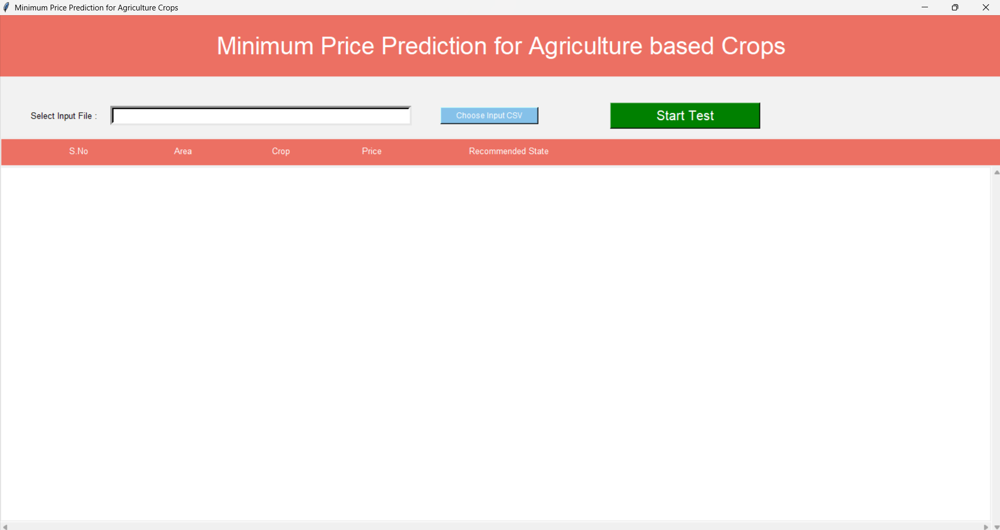
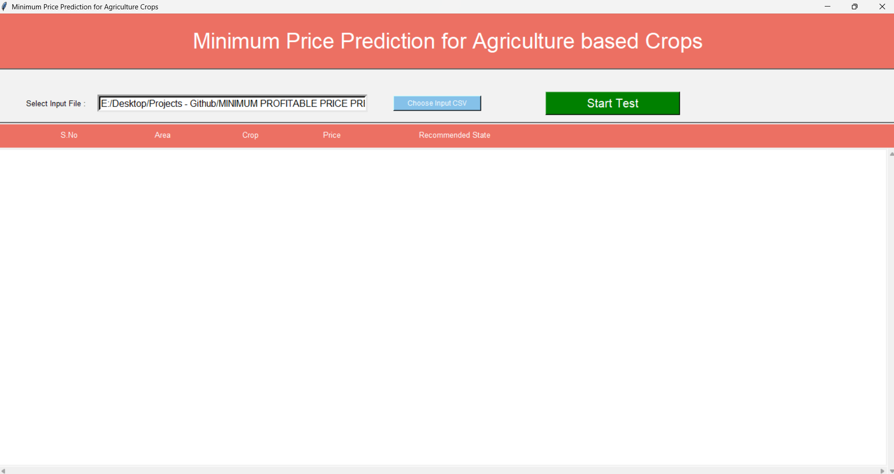
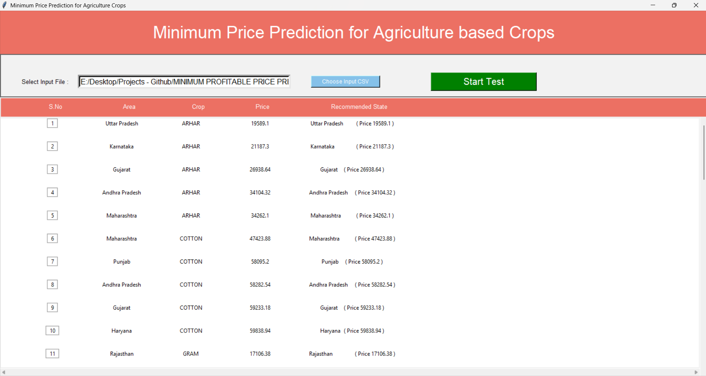

# Agricultural Price Predictor

Machine learning application to predict crop prices and recommend selling locations.

## Overview

Uses linear regression to predict minimum profitable prices for crops based on cultivation data. The GUI application loads crop data from CSV files, trains on historical market data, and provides price predictions with state recommendations.

## Installation

Requirements:
- Python 3.7+
- pandas
- scikit-learn
- numpy

Install:
```bash
pip install pandas scikit-learn numpy
```

## Usage

Run the application:
```bash
python agricultural_price_predictor.py
```

Steps:
1. Click "Choose Input CSV" to load crop data file
2. Click "Start Test" to run predictions
3. View results in table - shows predicted prices and recommended states for selling

### Application Screenshots

**Main GUI Interface:**


**Input Selection:**


**Prediction Results:**


## Input CSV Format

CSV file should contain:
- State
- Crop
- CostCultivation
- CostCultivation2
- Production
- Yield
- RainFall Annual

## Files

- `agricultural_price_predictor.py` - Main application with ML model and GUI
- `crop_training_data.csv` - Training data (318 crop records)
- `test_data.csv` - Sample test data

## How It Works

1. Trains linear regression model on historical crop data
2. Takes crop information as input
3. Predicts price based on cultivation costs, production, yield
4. Compares predicted price with market prices across different states
5. Recommends the state with best market price for that crop

## Example

Input: ARHAR crop, Uttar Pradesh, costs 9800/9850, production 2000, yield 9.5

Output:
- Predicted price: 19589
- Recommended state: Karnataka (best market)

## Model Details

- Algorithm: Linear Regression
- Features: 5 agricultural parameters
- Training data: 318 records from 15 Indian states
- Output: Continuous price values

## Data Coverage

States: Uttar Pradesh, Karnataka, Gujarat, Andhra Pradesh, Maharashtra, Punjab, Haryana, Rajasthan, Madhya Pradesh, Tamil Nadu, West Bengal, Bihar, Orissa

Crops: ARHAR, RICE, WHEAT, and other crops

## License

MIT License
